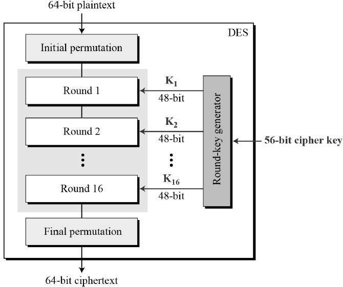

# DES

The Data Encryption Standard (DES) is a symmetric-key block cipher published by the National Institute of Standards and Technology (NIST).

DES is an implementation of a Feistel Cipher. It uses 16 round Feistel structure. The block size is 64-bit. Though, key length is 64-bit, DES has an effective key length of 56 bits, since 8 of the 64 bits of the key are not used by the encryption algorithm (function as check bits only).

Since DES is based on the Feistel Cipher, we have the following components:

    1.Round function
    2.Key schedule

Any additional processing − 
Initial and final permutation
Initial and Permutation
The initial and final permutations are straight Permutation boxes (P-boxes) that are inverses of each other.

Round Function

The heart of this cipher is the DES function, f. The DES function applies a 48-bit key to the rightmost 32 bits to produce a 32-bit output.

Expansion Permutation Box − Since right input is 32-bit and round key is a 48-bit, we first need to expand right input to 48 bits.

XOR (Whitener). − After the expansion permutation, DES does XOR operation on the expanded right section and the round key. The round key is used only in this operation.

Substitution Boxes. − The S-boxes carry out the real mixing (confusion). DES uses 8 S-boxes, each with a 6-bit input and a 4-bit output. 

There are a total of eight S-box tables. The output of all eight s-boxes is then combined in to 32 bit section.

Straight Permutation − The 32 bit output of S-boxes is then subjected to the straight permutation with rule shown in the following illustration:

Key Generation
The round-key generator creates sixteen 48-bit keys out of a 56-bit cipher key. 

The Overall DES Algorithm Architecture

The round-key generator Algorithm Architecture
![Round_Key_Generator][key_generation.jpg]

The Round Function Architecture
![Round_Function][round.jpg]